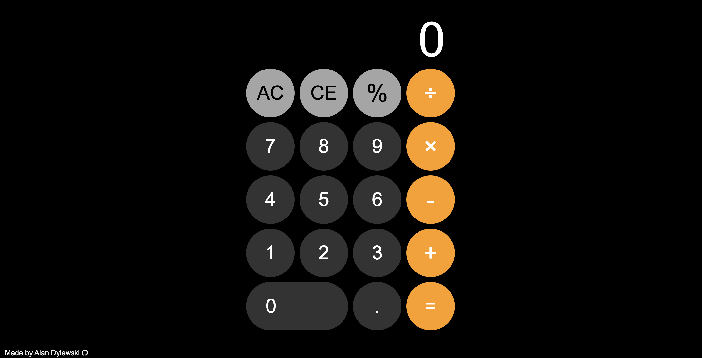

# calculator-top
An iOS inspired calculator made for The Odin Project curriculum. 

Languages used - HTML, CSS, Javascript.

## Final Outcome:

## Future TODO:
1. Fix percentage button 
2. Allow users to string together several operations 
3. Add keyboard support
4. Make the design responsive/mobile friendly.
5. Optimize the way points/periods are displayed (currently, if a user enters a float, such as "0.5" the calculator will display ".5")